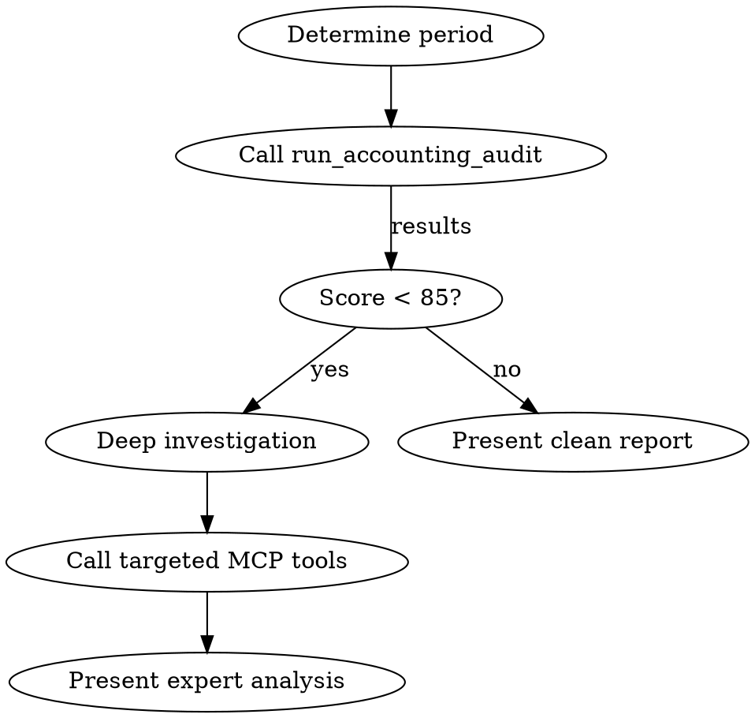

# Expert Comptable Implementation Plan

> **For Claude:** REQUIRED SUB-SKILL: Use superpowers:executing-plans to implement this plan task-by-task.

**Goal:** Build an automated accounting audit system accessible from the CashPilot UI (dashboard widget + dedicated page), Claude Code (skill), and MCP Server (tool).

**Architecture:** A single Supabase Edge Function (`audit-comptable`) contains all 17 audit checks. The frontend, MCP tool, and Claude Code skill all call this Edge Function. This ensures one source of truth for audit logic.

**Tech Stack:** Deno/TypeScript (Edge Function), React 18 + Tailwind + Shadcn (Frontend), TypeScript (MCP tool), Markdown (Skill)

**Design Doc:** `docs/plans/2026-02-26-expert-comptable-design.md`

---

## Task 1: Edge Function — Core Audit Engine

**Files:**
- Create: `supabase/functions/audit-comptable/index.ts`

**Context:** This is the heart of the system. All 17 checks run here. Follow the existing Edge Function pattern in the project (see `supabase/functions/auto-reconcile/index.ts` for reference).

**Step 1: Create the Edge Function file**

Create `supabase/functions/audit-comptable/index.ts` with the full implementation below. The function:
1. Accepts JWT auth via Authorization header
2. Parses `period_start`, `period_end`, optional `categories[]`, optional `country`
3. Fetches all needed data (entries, accounts, invoices, expenses, bank transactions)
4. Runs 17 checks grouped in 3 categories
5. Computes score/grade and returns structured JSON

```typescript
import { serve } from 'https://deno.land/std@0.177.0/http/server.ts';
import { createClient } from 'https://esm.sh/@supabase/supabase-js@2.39.3';

const corsHeaders = {
  'Access-Control-Allow-Origin': '*',
  'Access-Control-Allow-Headers': 'authorization, x-client-info, apikey, content-type',
};

// --- Valid VAT rates by country ---
const VALID_VAT_RATES: Record<string, number[]> = {
  FR: [0, 2.1, 5.5, 10, 20],
  BE: [0, 6, 12, 21],
  OHADA: [0, 5, 10, 15, 18, 19.25, 20],
};

// --- Severity weights for scoring ---
const SEVERITY_WEIGHT: Record<string, number> = { error: 10, warning: 5, info: 2 };

// --- Grade thresholds ---
function computeGrade(score: number): string {
  if (score >= 95) return 'A+';
  if (score >= 90) return 'A';
  if (score >= 85) return 'B+';
  if (score >= 80) return 'B';
  if (score >= 70) return 'C';
  if (score >= 60) return 'D';
  return 'F';
}

// --- Check result type ---
interface CheckResult {
  id: string;
  name: string;
  status: 'pass' | 'warning' | 'fail';
  severity: 'error' | 'warning' | 'info';
  details: string;
  recommendation: string | null;
  items?: any[];
}

interface Recommendation {
  priority: 'high' | 'medium' | 'low';
  category: string;
  check_id: string;
  message: string;
  action: string;
}

// ═══════════════════════════════════════════════════════════════
// BALANCE & COHERENCE CHECKS
// ═══════════════════════════════════════════════════════════════

function checkDebitCreditBalance(entries: any[]): CheckResult {
  const totalDebit = entries.reduce((s, e) => s + (parseFloat(e.debit) || 0), 0);
  const totalCredit = entries.reduce((s, e) => s + (parseFloat(e.credit) || 0), 0);
  const diff = Math.abs(totalDebit - totalCredit);
  const balanced = diff < 0.01;
  return {
    id: 'balance_debit_credit',
    name: 'Balance debit/credit',
    status: balanced ? 'pass' : 'fail',
    severity: 'error',
    details: `Total debits: ${totalDebit.toFixed(2)}, Total credits: ${totalCredit.toFixed(2)}${!balanced ? `, Difference: ${diff.toFixed(2)}` : ''}`,
    recommendation: balanced ? null : `Identifier et corriger l'ecart de ${diff.toFixed(2)} entre debits et credits.`,
  };
}

function checkBalanceSheetEquilibrium(entries: any[], accounts: any[]): CheckResult {
  const categoryMap: Record<string, string> = {};
  for (const acc of accounts) categoryMap[acc.account_code] = acc.account_category || 'other';

  const totals: Record<string, number> = { asset: 0, liability: 0, equity: 0 };
  for (const e of entries) {
    const cat = categoryMap[e.account_code] || 'other';
    if (cat in totals) {
      totals[cat] += (parseFloat(e.debit) || 0) - (parseFloat(e.credit) || 0);
    }
  }

  const diff = Math.abs(totals.asset - (Math.abs(totals.liability) + Math.abs(totals.equity)));
  const balanced = diff < 0.01;
  return {
    id: 'balance_sheet_equilibrium',
    name: 'Equilibre du bilan',
    status: balanced ? 'pass' : 'fail',
    severity: 'error',
    details: `Actif: ${totals.asset.toFixed(2)}, Passif+CP: ${(Math.abs(totals.liability) + Math.abs(totals.equity)).toFixed(2)}`,
    recommendation: balanced ? null : `Le bilan est desequilibre de ${diff.toFixed(2)}. Verifier les ecritures de cloture.`,
  };
}

function checkChartOfAccountsCoherence(entries: any[], accounts: any[]): CheckResult {
  const validCodes = new Set(accounts.map((a: any) => a.account_code));
  const orphanEntries = entries.filter((e: any) => !validCodes.has(e.account_code));
  const passed = orphanEntries.length === 0;
  return {
    id: 'chart_coherence',
    name: 'Coherence plan comptable',
    status: passed ? 'pass' : 'fail',
    severity: 'error',
    details: passed
      ? `Toutes les ecritures referencent des comptes valides.`
      : `${orphanEntries.length} ecritures referencent des comptes inexistants.`,
    recommendation: passed ? null : `Creer les comptes manquants ou corriger les codes dans les ecritures orphelines.`,
    items: passed ? undefined : orphanEntries.slice(0, 10).map(e => ({ id: e.id, account_code: e.account_code, description: e.description })),
  };
}

function checkEntrySequence(entries: any[]): CheckResult {
  const nums = entries.map(e => parseInt(e.entry_number || e.id, 10)).filter(n => !isNaN(n)).sort((a, b) => a - b);
  const gaps: number[] = [];
  for (let i = 1; i < nums.length; i++) {
    if (nums[i] - nums[i - 1] > 1) gaps.push(nums[i - 1] + 1);
  }
  const passed = gaps.length === 0;
  return {
    id: 'entry_sequence',
    name: 'Sequence des ecritures',
    status: passed ? 'pass' : 'warning',
    severity: 'warning',
    details: passed ? 'Numerotation continue sans trou.' : `${gaps.length} trou(s) detecte(s) dans la numerotation.`,
    recommendation: passed ? null : `Verifier les ecritures manquantes aux positions: ${gaps.slice(0, 5).join(', ')}${gaps.length > 5 ? '...' : ''}`,
  };
}

function checkZeroEntries(entries: any[]): CheckResult {
  const zeroEntries = entries.filter(e => (parseFloat(e.debit) || 0) === 0 && (parseFloat(e.credit) || 0) === 0);
  const passed = zeroEntries.length === 0;
  return {
    id: 'zero_entries',
    name: 'Ecritures a zero',
    status: passed ? 'pass' : 'warning',
    severity: 'warning',
    details: passed ? 'Aucune ecriture a zero.' : `${zeroEntries.length} ecriture(s) avec debit et credit a 0.`,
    recommendation: passed ? null : `Supprimer ou corriger les ${zeroEntries.length} ecritures a zero.`,
    items: passed ? undefined : zeroEntries.slice(0, 5).map(e => ({ id: e.id, description: e.description, date: e.transaction_date })),
  };
}

function checkSuspenseAccounts(entries: any[]): CheckResult {
  const suspenseBalances: Record<string, number> = {};
  for (const e of entries) {
    if (e.account_code?.startsWith('47')) {
      suspenseBalances[e.account_code] = (suspenseBalances[e.account_code] || 0) + (parseFloat(e.debit) || 0) - (parseFloat(e.credit) || 0);
    }
  }
  const unsettled = Object.entries(suspenseBalances).filter(([, bal]) => Math.abs(bal) > 0.01);
  const passed = unsettled.length === 0;
  return {
    id: 'suspense_accounts',
    name: 'Comptes d\'attente non soldes',
    status: passed ? 'pass' : 'warning',
    severity: 'warning',
    details: passed ? 'Tous les comptes d\'attente (47x) sont soldes.' : `${unsettled.length} compte(s) d'attente non solde(s).`,
    recommendation: passed ? null : `Solder les comptes: ${unsettled.map(([c, b]) => `${c} (${b.toFixed(2)})`).join(', ')}`,
  };
}

function checkDateCoherence(entries: any[], periodStart: string, periodEnd: string): CheckResult {
  const outOfRange = entries.filter(e => {
    const d = e.transaction_date;
    return d && (d < periodStart || d > periodEnd);
  });
  const passed = outOfRange.length === 0;
  return {
    id: 'date_coherence',
    name: 'Coherence des dates',
    status: passed ? 'pass' : 'fail',
    severity: 'error',
    details: passed ? 'Toutes les ecritures sont dans la periode.' : `${outOfRange.length} ecriture(s) hors periode.`,
    recommendation: passed ? null : `Verifier les ${outOfRange.length} ecritures datees hors de la periode ${periodStart} - ${periodEnd}.`,
    items: passed ? undefined : outOfRange.slice(0, 5).map(e => ({ id: e.id, date: e.transaction_date, description: e.description })),
  };
}

// ═══════════════════════════════════════════════════════════════
// FISCAL COMPLIANCE CHECKS
// ═══════════════════════════════════════════════════════════════

function checkVatRates(invoices: any[], country: string): CheckResult {
  const validRates = VALID_VAT_RATES[country] || VALID_VAT_RATES.FR;
  const invalidInvoices = invoices.filter(inv => {
    const rate = parseFloat(inv.tax_rate ?? inv.vat_rate ?? 0);
    return rate > 0 && !validRates.includes(rate);
  });
  const passed = invalidInvoices.length === 0;
  return {
    id: 'vat_rates_valid',
    name: 'Taux de TVA valides',
    status: passed ? 'pass' : 'fail',
    severity: 'error',
    details: passed
      ? `Tous les taux de TVA sont conformes (${country}: ${validRates.join('/')}%).`
      : `${invalidInvoices.length} facture(s) avec des taux de TVA non standard.`,
    recommendation: passed ? null : `Corriger les taux de TVA des factures concernees. Taux legaux ${country}: ${validRates.join('/')}%.`,
    items: passed ? undefined : invalidInvoices.slice(0, 5).map(i => ({ invoice_number: i.invoice_number, rate: i.tax_rate ?? i.vat_rate })),
  };
}

function checkVatDeclaration(invoices: any[], expenses: any[]): CheckResult {
  const outputVat = invoices.reduce((s, i) => s + ((parseFloat(i.total_ttc) || 0) - (parseFloat(i.total_ht) || 0)), 0);
  const inputVat = expenses.reduce((s, e) => s + (parseFloat(e.vat_amount) || 0), 0);
  const vatPayable = outputVat - inputVat;
  return {
    id: 'vat_declaration',
    name: 'Validation TVA (CA3/Intervat)',
    status: 'pass',
    severity: 'warning',
    details: `TVA collectee: ${outputVat.toFixed(2)}, TVA deductible: ${inputVat.toFixed(2)}, TVA a payer: ${vatPayable.toFixed(2)}`,
    recommendation: vatPayable < 0 ? `Credit de TVA de ${Math.abs(vatPayable).toFixed(2)} - verifier l'eligibilite au remboursement.` : null,
  };
}

function checkFecConformity(entries: any[]): CheckResult {
  const requiredFields = ['account_code', 'account_name', 'transaction_date', 'description'];
  const incomplete = entries.filter(e => requiredFields.some(f => !e[f] || e[f] === ''));
  const passed = incomplete.length === 0;
  return {
    id: 'fec_conformity',
    name: 'Conformite FEC',
    status: passed ? 'pass' : 'fail',
    severity: 'error',
    details: passed ? 'Toutes les ecritures ont les champs FEC obligatoires.' : `${incomplete.length} ecriture(s) avec champs manquants.`,
    recommendation: passed ? null : `Completer les champs manquants (account_code, account_name, transaction_date, description).`,
    items: passed ? undefined : incomplete.slice(0, 5).map(e => ({ id: e.id, missing: requiredFields.filter(f => !e[f]) })),
  };
}

function checkVatReconciliation(invoices: any[], entries: any[]): CheckResult {
  const invoiceVat = invoices.reduce((s, i) => s + ((parseFloat(i.total_ttc) || 0) - (parseFloat(i.total_ht) || 0)), 0);
  const vatAccounts = entries.filter(e => e.account_code?.startsWith('445'));
  const entryVat = vatAccounts.reduce((s, e) => s + (parseFloat(e.credit) || 0) - (parseFloat(e.debit) || 0), 0);
  const diff = Math.abs(invoiceVat - entryVat);
  const passed = diff < 1;
  return {
    id: 'vat_reconciliation',
    name: 'Rapprochement TVA',
    status: passed ? 'pass' : 'warning',
    severity: 'warning',
    details: `TVA factures: ${invoiceVat.toFixed(2)}, TVA comptabilisee (445x): ${entryVat.toFixed(2)}${!passed ? `, Ecart: ${diff.toFixed(2)}` : ''}`,
    recommendation: passed ? null : `Ecart de ${diff.toFixed(2)} entre TVA facturee et comptabilisee. Verifier les ecritures de TVA.`,
  };
}

function checkInvoicesWithoutVat(invoices: any[]): CheckResult {
  const threshold = 150;
  const suspicious = invoices.filter(i => {
    const ht = parseFloat(i.total_ht) || 0;
    const ttc = parseFloat(i.total_ttc) || 0;
    return ht > threshold && Math.abs(ttc - ht) < 0.01;
  });
  const passed = suspicious.length === 0;
  return {
    id: 'invoices_without_vat',
    name: 'Factures sans TVA',
    status: passed ? 'pass' : 'warning',
    severity: 'warning',
    details: passed ? `Aucune facture > ${threshold} EUR sans TVA.` : `${suspicious.length} facture(s) > ${threshold} EUR sans TVA.`,
    recommendation: passed ? null : `Verifier si l'exoneration de TVA est justifiee (export, auto-liquidation, franchise).`,
    items: passed ? undefined : suspicious.slice(0, 5).map(i => ({ invoice_number: i.invoice_number, total_ht: i.total_ht })),
  };
}

// ═══════════════════════════════════════════════════════════════
// ANOMALY DETECTION CHECKS
// ═══════════════════════════════════════════════════════════════

function checkDuplicates(entries: any[]): CheckResult {
  const seen = new Map<string, any[]>();
  for (const e of entries) {
    const key = `${e.account_code}|${e.transaction_date}|${e.debit}|${e.credit}`;
    if (!seen.has(key)) seen.set(key, []);
    seen.get(key)!.push(e);
  }
  const dupes = [...seen.values()].filter(arr => arr.length > 1);
  const passed = dupes.length === 0;
  return {
    id: 'duplicates',
    name: 'Doublons',
    status: passed ? 'pass' : 'warning',
    severity: 'warning',
    details: passed ? 'Aucun doublon detecte.' : `${dupes.length} groupe(s) de doublons potentiels.`,
    recommendation: passed ? null : `Examiner et supprimer les ecritures en double si confirmees.`,
    items: passed ? undefined : dupes.slice(0, 3).map(group => group.map(e => ({ id: e.id, date: e.transaction_date, amount: `D:${e.debit} C:${e.credit}` }))),
  };
}

function checkAbnormalAmounts(entries: any[]): CheckResult {
  const byAccount: Record<string, number[]> = {};
  for (const e of entries) {
    const amt = Math.max(parseFloat(e.debit) || 0, parseFloat(e.credit) || 0);
    if (amt > 0) {
      if (!byAccount[e.account_code]) byAccount[e.account_code] = [];
      byAccount[e.account_code].push(amt);
    }
  }

  const outliers: any[] = [];
  for (const [code, amounts] of Object.entries(byAccount)) {
    if (amounts.length < 5) continue;
    const mean = amounts.reduce((s, a) => s + a, 0) / amounts.length;
    const stdDev = Math.sqrt(amounts.reduce((s, a) => s + (a - mean) ** 2, 0) / amounts.length);
    if (stdDev === 0) continue;
    const threshold = mean + 3 * stdDev;
    const abnormal = entries.filter(e => {
      if (e.account_code !== code) return false;
      const amt = Math.max(parseFloat(e.debit) || 0, parseFloat(e.credit) || 0);
      return amt > threshold;
    });
    outliers.push(...abnormal);
  }

  const passed = outliers.length === 0;
  return {
    id: 'abnormal_amounts',
    name: 'Montants aberrants',
    status: passed ? 'pass' : 'warning',
    severity: 'warning',
    details: passed ? 'Aucun montant aberrant detecte.' : `${outliers.length} ecriture(s) avec montants > 3 ecarts-types.`,
    recommendation: passed ? null : `Verifier les ecritures avec des montants inhabituellement eleves.`,
    items: passed ? undefined : outliers.slice(0, 5).map(e => ({ id: e.id, account: e.account_code, debit: e.debit, credit: e.credit })),
  };
}

function checkRoundAmounts(entries: any[]): CheckResult {
  const roundThreshold = 1000;
  const roundEntries = entries.filter(e => {
    const amt = Math.max(parseFloat(e.debit) || 0, parseFloat(e.credit) || 0);
    return amt >= roundThreshold && amt % 1000 === 0;
  });
  const ratio = entries.length > 0 ? roundEntries.length / entries.length : 0;
  const suspicious = ratio > 0.15;
  return {
    id: 'round_amounts',
    name: 'Chiffres ronds suspects',
    status: suspicious ? 'warning' : 'pass',
    severity: 'info',
    details: `${roundEntries.length} ecriture(s) en chiffres ronds (>= ${roundThreshold}), soit ${(ratio * 100).toFixed(1)}% du total.`,
    recommendation: suspicious ? `Proportion elevee de montants ronds (${(ratio * 100).toFixed(1)}%). Verifier s'ils correspondent a des estimations.` : null,
  };
}

function checkRarelyUsedAccounts(entries: any[]): CheckResult {
  const countByAccount: Record<string, number> = {};
  for (const e of entries) {
    countByAccount[e.account_code] = (countByAccount[e.account_code] || 0) + 1;
  }
  const rare = Object.entries(countByAccount).filter(([, count]) => count === 1);
  const passed = rare.length === 0;
  return {
    id: 'rarely_used_accounts',
    name: 'Comptes rarement utilises',
    status: passed ? 'pass' : 'warning',
    severity: 'info',
    details: passed ? 'Aucun compte avec une seule ecriture.' : `${rare.length} compte(s) avec une seule ecriture.`,
    recommendation: passed ? null : `Verifier les comptes: ${rare.slice(0, 5).map(([c]) => c).join(', ')}. Une seule ecriture peut indiquer une erreur d'imputation.`,
  };
}

function checkBankReconciliation(bankTx: any[]): CheckResult {
  const unreconciled = bankTx.filter(t => !t.invoice_id && !t.is_ignored);
  const total = bankTx.length;
  const ratio = total > 0 ? unreconciled.length / total : 0;
  const passed = ratio < 0.1;
  return {
    id: 'bank_reconciliation',
    name: 'Rapprochement bancaire',
    status: passed ? 'pass' : 'warning',
    severity: 'warning',
    details: total > 0
      ? `${unreconciled.length}/${total} transactions non rapprochees (${(ratio * 100).toFixed(1)}%).`
      : 'Aucune transaction bancaire trouvee.',
    recommendation: !passed ? `${unreconciled.length} transactions bancaires a rapprocher. Utiliser le rapprochement automatique.` : null,
  };
}

// ═══════════════════════════════════════════════════════════════
// MAIN HANDLER
// ═══════════════════════════════════════════════════════════════

serve(async (req) => {
  if (req.method === 'OPTIONS') return new Response('ok', { headers: corsHeaders });

  try {
    // Auth
    const authHeader = req.headers.get('Authorization');
    if (!authHeader?.startsWith('Bearer ')) {
      return new Response(JSON.stringify({ error: 'Missing Authorization header' }),
        { status: 401, headers: { ...corsHeaders, 'Content-Type': 'application/json' } });
    }

    const supabaseUrl = Deno.env.get('SUPABASE_URL')!;
    const supabaseAnonKey = Deno.env.get('SUPABASE_ANON_KEY')!;
    const supabaseServiceKey = Deno.env.get('SUPABASE_SERVICE_ROLE_KEY')!;

    // Verify JWT
    const authClient = createClient(supabaseUrl, supabaseAnonKey, {
      global: { headers: { Authorization: authHeader } },
    });
    const { data: { user }, error: authError } = await authClient.auth.getUser();
    if (authError || !user) {
      return new Response(JSON.stringify({ error: 'Invalid token' }),
        { status: 401, headers: { ...corsHeaders, 'Content-Type': 'application/json' } });
    }

    const userId = user.id;
    const supabase = createClient(supabaseUrl, supabaseServiceKey);

    // Parse body
    const body = await req.json().catch(() => ({}));
    const periodStart: string = body.period_start || new Date(new Date().getFullYear(), 0, 1).toISOString().split('T')[0];
    const periodEnd: string = body.period_end || new Date().toISOString().split('T')[0];
    const requestedCategories: string[] = body.categories || ['balance', 'fiscal', 'anomalies'];

    // Auto-detect country
    let country: string = body.country || 'FR';
    if (!body.country) {
      const { data: settings } = await supabase
        .from('user_accounting_settings')
        .select('country')
        .eq('user_id', userId)
        .maybeSingle();
      if (settings?.country) country = settings.country;
    }

    // Fetch all data in parallel
    const [entriesRes, accountsRes, invoicesRes, expensesRes, bankTxRes] = await Promise.all([
      supabase.from('accounting_entries').select('*').eq('user_id', userId)
        .gte('transaction_date', periodStart).lte('transaction_date', periodEnd)
        .order('transaction_date', { ascending: true }),
      supabase.from('accounting_chart_of_accounts').select('*').eq('user_id', userId),
      supabase.from('invoices').select('*').eq('user_id', userId)
        .gte('date', periodStart).lte('date', periodEnd),
      supabase.from('expenses').select('*').eq('user_id', userId)
        .gte('date', periodStart).lte('date', periodEnd),
      supabase.from('bank_transactions').select('*').eq('user_id', userId)
        .gte('date', periodStart).lte('date', periodEnd),
    ]);

    const entries = entriesRes.data || [];
    const accounts = accountsRes.data || [];
    const invoices = invoicesRes.data || [];
    const expenses = expensesRes.data || [];
    const bankTx = bankTxRes.data || [];

    // Run checks by category
    const categories: Record<string, { label: string; checks: CheckResult[] }> = {};

    if (requestedCategories.includes('balance')) {
      categories.balance = {
        label: 'Equilibre & Coherence',
        checks: [
          checkDebitCreditBalance(entries),
          checkBalanceSheetEquilibrium(entries, accounts),
          checkChartOfAccountsCoherence(entries, accounts),
          checkEntrySequence(entries),
          checkZeroEntries(entries),
          checkSuspenseAccounts(entries),
          checkDateCoherence(entries, periodStart, periodEnd),
        ],
      };
    }

    if (requestedCategories.includes('fiscal')) {
      categories.fiscal = {
        label: 'Conformite Fiscale',
        checks: [
          checkVatRates(invoices, country),
          checkVatDeclaration(invoices, expenses),
          checkFecConformity(entries),
          checkVatReconciliation(invoices, entries),
          checkInvoicesWithoutVat(invoices),
        ],
      };
    }

    if (requestedCategories.includes('anomalies')) {
      categories.anomalies = {
        label: 'Detection d\'Anomalies',
        checks: [
          checkDuplicates(entries),
          checkAbnormalAmounts(entries),
          checkRoundAmounts(entries),
          checkRarelyUsedAccounts(entries),
          checkBankReconciliation(bankTx),
        ],
      };
    }

    // Compute scores
    let totalWeight = 0;
    let failedWeight = 0;
    let totalChecks = 0;
    let passed = 0;
    let warnings = 0;
    let errors = 0;

    const recommendations: Recommendation[] = [];

    const scoredCategories: Record<string, any> = {};
    for (const [catKey, cat] of Object.entries(categories)) {
      let catTotalWeight = 0;
      let catFailedWeight = 0;

      for (const check of cat.checks) {
        const weight = SEVERITY_WEIGHT[check.severity] || 2;
        catTotalWeight += weight;
        totalWeight += weight;
        totalChecks++;

        if (check.status === 'pass') {
          passed++;
        } else if (check.status === 'warning') {
          warnings++;
          catFailedWeight += weight * 0.5;
          failedWeight += weight * 0.5;
        } else {
          errors++;
          catFailedWeight += weight;
          failedWeight += weight;
        }

        if (check.recommendation) {
          recommendations.push({
            priority: check.severity === 'error' ? 'high' : check.severity === 'warning' ? 'medium' : 'low',
            category: catKey,
            check_id: check.id,
            message: check.recommendation,
            action: check.recommendation,
          });
        }
      }

      const catScore = catTotalWeight > 0 ? Math.round(((catTotalWeight - catFailedWeight) / catTotalWeight) * 100) : 100;
      scoredCategories[catKey] = { score: catScore, label: cat.label, checks: cat.checks };
    }

    const overallScore = totalWeight > 0 ? Math.round(((totalWeight - failedWeight) / totalWeight) * 100) : 100;

    // Sort recommendations by priority
    const priorityOrder = { high: 0, medium: 1, low: 2 };
    recommendations.sort((a, b) => priorityOrder[a.priority] - priorityOrder[b.priority]);

    const result = {
      score: overallScore,
      grade: computeGrade(overallScore),
      period: { start: periodStart, end: periodEnd },
      country,
      generated_at: new Date().toISOString(),
      summary: { total_checks: totalChecks, passed, warnings, errors },
      categories: scoredCategories,
      recommendations,
      data_summary: {
        entries_count: entries.length,
        accounts_count: accounts.length,
        invoices_count: invoices.length,
        expenses_count: expenses.length,
        bank_transactions_count: bankTx.length,
      },
    };

    return new Response(JSON.stringify(result), {
      headers: { ...corsHeaders, 'Content-Type': 'application/json' },
    });

  } catch (error: any) {
    return new Response(JSON.stringify({ error: error.message }),
      { status: 500, headers: { ...corsHeaders, 'Content-Type': 'application/json' } });
  }
});
```

**Step 2: Verify the function file was created**

Run: `ls -la supabase/functions/audit-comptable/`
Expected: `index.ts` exists

**Step 3: Commit**

```bash
git add supabase/functions/audit-comptable/index.ts
git commit -m "feat: add audit-comptable Edge Function with 17 accounting checks"
```

---

## Task 2: Custom Hook — `useAuditComptable`

**Files:**
- Create: `src/hooks/useAuditComptable.js`

**Context:** This hook calls the Edge Function and manages audit state (loading, results, cache). It will be used by both the Dashboard widget and the dedicated page. Follow the pattern from `src/hooks/useCashFlow.js`.

**Step 1: Create the hook**

```javascript
import { useState, useCallback, useEffect } from 'react';
import { supabase } from '@/lib/supabase';
import { useAuth } from '@/context/AuthContext';

const CACHE_KEY = 'cashpilot_audit_cache';
const CACHE_TTL = 24 * 60 * 60 * 1000; // 24h

export const useAuditComptable = (autoLoad = false) => {
  const { user } = useAuth();
  const [auditResult, setAuditResult] = useState(null);
  const [loading, setLoading] = useState(false);
  const [error, setError] = useState(null);

  // Load from cache
  useEffect(() => {
    if (!autoLoad || !user) return;
    const cached = localStorage.getItem(CACHE_KEY);
    if (cached) {
      try {
        const { data, timestamp } = JSON.parse(cached);
        if (Date.now() - timestamp < CACHE_TTL) {
          setAuditResult(data);
          return;
        }
      } catch { /* ignore invalid cache */ }
    }
    // No valid cache, run audit with default period (current year)
    const year = new Date().getFullYear();
    runAudit(`${year}-01-01`, new Date().toISOString().split('T')[0]);
  }, [user, autoLoad]);

  const runAudit = useCallback(async (periodStart, periodEnd, categories = null) => {
    if (!user) return;
    setLoading(true);
    setError(null);

    try {
      const { data: { session } } = await supabase.auth.getSession();
      if (!session?.access_token) throw new Error('Not authenticated');

      const body = {
        period_start: periodStart,
        period_end: periodEnd,
      };
      if (categories) body.categories = categories;

      const response = await fetch(
        `${import.meta.env.VITE_SUPABASE_URL}/functions/v1/audit-comptable`,
        {
          method: 'POST',
          headers: {
            'Content-Type': 'application/json',
            Authorization: `Bearer ${session.access_token}`,
          },
          body: JSON.stringify(body),
        }
      );

      if (!response.ok) {
        const err = await response.json().catch(() => ({}));
        throw new Error(err.error || `HTTP ${response.status}`);
      }

      const result = await response.json();
      setAuditResult(result);

      // Cache the result
      localStorage.setItem(CACHE_KEY, JSON.stringify({ data: result, timestamp: Date.now() }));

      return result;
    } catch (err) {
      setError(err.message);
      return null;
    } finally {
      setLoading(false);
    }
  }, [user]);

  const clearCache = useCallback(() => {
    localStorage.removeItem(CACHE_KEY);
    setAuditResult(null);
  }, []);

  return { auditResult, loading, error, runAudit, clearCache };
};
```

**Step 2: Commit**

```bash
git add src/hooks/useAuditComptable.js
git commit -m "feat: add useAuditComptable hook with 24h cache"
```

---

## Task 3: Dashboard Widget — `AccountingHealthWidget`

**Files:**
- Create: `src/components/AccountingHealthWidget.jsx`
- Modify: `src/pages/Dashboard.jsx` (add widget after the Cash Flow section)

**Context:** A compact glassmorphism card on the Dashboard showing the audit score as a circular gauge, 3 category mini-indicators, and an "Audit complet" button. Uses `useAuditComptable(true)` for auto-loading with cache.

**Step 1: Create the widget component**

```jsx
import React from 'react';
import { Link } from 'react-router-dom';
import { useTranslation } from 'react-i18next';
import { useAuditComptable } from '@/hooks/useAuditComptable';
import { motion } from 'framer-motion';
import { ShieldCheck, Loader2, AlertTriangle, CheckCircle, XCircle, ArrowRight } from 'lucide-react';
import { Button } from '@/components/ui/button';

const ScoreGauge = ({ score, grade, size = 120 }) => {
  const radius = (size - 16) / 2;
  const circumference = 2 * Math.PI * radius;
  const progress = (score / 100) * circumference;
  const color = score >= 85 ? '#22c55e' : score >= 70 ? '#f59e0b' : '#ef4444';

  return (
    <div className="relative" style={{ width: size, height: size }}>
      <svg width={size} height={size} className="-rotate-90">
        <circle cx={size/2} cy={size/2} r={radius} fill="none" stroke="rgba(255,255,255,0.1)" strokeWidth="8" />
        <circle cx={size/2} cy={size/2} r={radius} fill="none" stroke={color} strokeWidth="8"
          strokeDasharray={circumference} strokeDashoffset={circumference - progress}
          strokeLinecap="round" className="transition-all duration-1000 ease-out" />
      </svg>
      <div className="absolute inset-0 flex flex-col items-center justify-center">
        <span className="text-2xl font-bold text-white">{score}</span>
        <span className="text-xs font-medium" style={{ color }}>{grade}</span>
      </div>
    </div>
  );
};

const CategoryIndicator = ({ label, score }) => {
  const color = score >= 85 ? 'text-green-400' : score >= 70 ? 'text-yellow-400' : 'text-red-400';
  const bgColor = score >= 85 ? 'bg-green-400/10' : score >= 70 ? 'bg-yellow-400/10' : 'bg-red-400/10';
  const Icon = score >= 85 ? CheckCircle : score >= 70 ? AlertTriangle : XCircle;

  return (
    <div className={`flex items-center gap-2 px-3 py-1.5 rounded-lg ${bgColor}`}>
      <Icon className={`w-3.5 h-3.5 ${color}`} />
      <span className="text-xs text-gray-300">{label}</span>
      <span className={`text-xs font-semibold ml-auto ${color}`}>{score}%</span>
    </div>
  );
};

const AccountingHealthWidget = () => {
  const { t } = useTranslation();
  const { auditResult, loading, error } = useAuditComptable(true);

  if (loading && !auditResult) {
    return (
      <motion.div initial={{ opacity: 0, y: 20 }} animate={{ opacity: 1, y: 0 }}
        className="glass-card rounded-2xl p-6 border border-white/5">
        <div className="flex items-center gap-3 mb-4">
          <ShieldCheck className="w-5 h-5 text-orange-400" />
          <h3 className="text-lg font-semibold text-white">Sante Comptable</h3>
        </div>
        <div className="flex items-center justify-center py-8">
          <Loader2 className="w-6 h-6 text-orange-400 animate-spin" />
        </div>
      </motion.div>
    );
  }

  if (error || !auditResult) {
    return (
      <motion.div initial={{ opacity: 0, y: 20 }} animate={{ opacity: 1, y: 0 }}
        className="glass-card rounded-2xl p-6 border border-white/5">
        <div className="flex items-center gap-3 mb-4">
          <ShieldCheck className="w-5 h-5 text-orange-400" />
          <h3 className="text-lg font-semibold text-white">Sante Comptable</h3>
        </div>
        <p className="text-gray-400 text-sm mb-4">
          {error || 'Lancez votre premier audit pour voir votre score.'}
        </p>
        <Link to="/app/audit-comptable">
          <Button size="sm" className="bg-orange-500 hover:bg-orange-600 text-white w-full">
            Lancer l'audit <ArrowRight className="w-4 h-4 ml-2" />
          </Button>
        </Link>
      </motion.div>
    );
  }

  const { score, grade, categories, summary } = auditResult;

  return (
    <motion.div initial={{ opacity: 0, y: 20 }} animate={{ opacity: 1, y: 0 }}
      className="glass-card rounded-2xl p-6 border border-white/5">
      <div className="flex items-center justify-between mb-4">
        <div className="flex items-center gap-3">
          <ShieldCheck className="w-5 h-5 text-orange-400" />
          <h3 className="text-lg font-semibold text-white">Sante Comptable</h3>
        </div>
        <span className="text-xs text-gray-500">
          {summary.passed}/{summary.total_checks} ok
        </span>
      </div>

      <div className="flex items-center gap-6">
        <ScoreGauge score={score} grade={grade} />
        <div className="flex-1 space-y-2">
          {categories.balance && <CategoryIndicator label="Equilibre" score={categories.balance.score} />}
          {categories.fiscal && <CategoryIndicator label="Fiscal" score={categories.fiscal.score} />}
          {categories.anomalies && <CategoryIndicator label="Anomalies" score={categories.anomalies.score} />}
        </div>
      </div>

      <Link to="/app/audit-comptable" className="block mt-4">
        <Button size="sm" variant="outline" className="w-full border-gray-600 hover:bg-gray-700 text-gray-300">
          Audit complet <ArrowRight className="w-4 h-4 ml-2" />
        </Button>
      </Link>
    </motion.div>
  );
};

export default AccountingHealthWidget;
```

**Step 2: Add the widget to Dashboard.jsx**

In `src/pages/Dashboard.jsx`, add the import at the top (after other imports):

```javascript
import AccountingHealthWidget from '@/components/AccountingHealthWidget';
```

Then add the widget in the Dashboard JSX. Insert it in the grid after the Cash Flow chart section, as a new card in the right column. Find the section where the Cash Flow chart ends (after the `</motion.div>` that contains the BarChart) and add:

```jsx
{/* Accounting Health Widget */}
<AccountingHealthWidget />
```

**Step 3: Commit**

```bash
git add src/components/AccountingHealthWidget.jsx src/pages/Dashboard.jsx
git commit -m "feat: add AccountingHealthWidget on Dashboard with circular gauge"
```

---

## Task 4: Dedicated Page — `AuditComptable.jsx`

**Files:**
- Create: `src/pages/AuditComptable.jsx`

**Context:** Full audit page with period selector, 3 tabs (one per category), detailed check results, and download button. Uses `useAuditComptable()` with manual trigger.

**Step 1: Create the page**

```jsx
import React, { useState, useMemo } from 'react';
import { Helmet } from 'react-helmet';
import { useTranslation } from 'react-i18next';
import { useAuditComptable } from '@/hooks/useAuditComptable';
import { motion } from 'framer-motion';
import {
  ShieldCheck, Loader2, Play, Download, CheckCircle, AlertTriangle, XCircle,
  ChevronDown, ChevronUp, Calendar, RefreshCw
} from 'lucide-react';
import { Button } from '@/components/ui/button';
import { Tabs, TabsContent, TabsList, TabsTrigger } from '@/components/ui/tabs';

// --- Period presets ---
const getPeriodPresets = () => {
  const now = new Date();
  const year = now.getFullYear();
  const month = now.getMonth();
  const quarter = Math.floor(month / 3);
  const qStart = new Date(year, quarter * 3, 1);
  const qEnd = new Date(year, quarter * 3 + 3, 0);

  return [
    { label: 'Annee en cours', start: `${year}-01-01`, end: now.toISOString().split('T')[0] },
    { label: 'Annee precedente', start: `${year - 1}-01-01`, end: `${year - 1}-12-31` },
    { label: 'Trimestre en cours', start: qStart.toISOString().split('T')[0], end: qEnd.toISOString().split('T')[0] },
    {
      label: 'Mois en cours',
      start: `${year}-${String(month + 1).padStart(2, '0')}-01`,
      end: now.toISOString().split('T')[0],
    },
  ];
};

// --- Status icon ---
const StatusIcon = ({ status, className = 'w-5 h-5' }) => {
  if (status === 'pass') return <CheckCircle className={`${className} text-green-400`} />;
  if (status === 'warning') return <AlertTriangle className={`${className} text-yellow-400`} />;
  return <XCircle className={`${className} text-red-400`} />;
};

// --- Single check row ---
const CheckRow = ({ check }) => {
  const [expanded, setExpanded] = useState(false);

  return (
    <div className="border border-white/5 rounded-lg overflow-hidden">
      <button
        onClick={() => setExpanded(!expanded)}
        className="w-full flex items-center gap-3 p-4 hover:bg-white/5 transition-colors text-left"
      >
        <StatusIcon status={check.status} />
        <div className="flex-1">
          <p className="text-sm font-medium text-white">{check.name}</p>
          <p className="text-xs text-gray-400 mt-0.5">{check.details}</p>
        </div>
        <span className={`text-xs px-2 py-0.5 rounded ${
          check.severity === 'error' ? 'bg-red-400/10 text-red-400' :
          check.severity === 'warning' ? 'bg-yellow-400/10 text-yellow-400' :
          'bg-blue-400/10 text-blue-400'
        }`}>
          {check.severity}
        </span>
        {(check.recommendation || check.items) && (
          expanded ? <ChevronUp className="w-4 h-4 text-gray-500" /> : <ChevronDown className="w-4 h-4 text-gray-500" />
        )}
      </button>

      {expanded && (check.recommendation || check.items) && (
        <div className="px-4 pb-4 border-t border-white/5 pt-3">
          {check.recommendation && (
            <p className="text-sm text-orange-300 mb-2">
              Recommandation: {check.recommendation}
            </p>
          )}
          {check.items && check.items.length > 0 && (
            <div className="bg-black/20 rounded-lg p-3 mt-2">
              <p className="text-xs text-gray-400 mb-2">Elements concernes:</p>
              <pre className="text-xs text-gray-300 overflow-x-auto">
                {JSON.stringify(check.items, null, 2)}
              </pre>
            </div>
          )}
        </div>
      )}
    </div>
  );
};

// --- Category tab content ---
const CategoryContent = ({ category }) => {
  if (!category) return null;

  const scoreColor = category.score >= 85 ? 'text-green-400' : category.score >= 70 ? 'text-yellow-400' : 'text-red-400';

  return (
    <div>
      <div className="flex items-center justify-between mb-4">
        <h3 className="text-lg font-semibold text-white">{category.label}</h3>
        <span className={`text-2xl font-bold ${scoreColor}`}>{category.score}%</span>
      </div>
      <div className="space-y-2">
        {category.checks.map((check) => (
          <CheckRow key={check.id} check={check} />
        ))}
      </div>
    </div>
  );
};

// --- Main page ---
const AuditComptable = () => {
  const { t } = useTranslation();
  const { auditResult, loading, error, runAudit, clearCache } = useAuditComptable(false);
  const presets = useMemo(() => getPeriodPresets(), []);

  const [periodStart, setPeriodStart] = useState(presets[0].start);
  const [periodEnd, setPeriodEnd] = useState(presets[0].end);

  const handleRunAudit = () => runAudit(periodStart, periodEnd);

  const handlePreset = (preset) => {
    setPeriodStart(preset.start);
    setPeriodEnd(preset.end);
  };

  const handleDownload = () => {
    if (!auditResult) return;
    const content = JSON.stringify(auditResult, null, 2);
    const blob = new Blob([content], { type: 'application/json' });
    const url = URL.createObjectURL(blob);
    const a = document.createElement('a');
    a.href = url;
    a.download = `audit-comptable-${auditResult.period.start}-${auditResult.period.end}.json`;
    a.click();
    URL.revokeObjectURL(url);
  };

  return (
    <>
      <Helmet>
        <title>Audit Comptable - {t('app.name')}</title>
      </Helmet>

      <div className="container mx-auto p-6">
        {/* Header */}
        <motion.div initial={{ opacity: 0, y: -20 }} animate={{ opacity: 1, y: 0 }} className="mb-8">
          <div className="flex items-center gap-3 mb-1">
            <ShieldCheck className="w-8 h-8 text-orange-400" />
            <h1 className="text-3xl md:text-4xl font-bold text-gradient">Audit Comptable</h1>
          </div>
          <p className="text-gray-500 text-sm">Verification et validation automatisee de votre comptabilite</p>
        </motion.div>

        {/* Controls */}
        <motion.div initial={{ opacity: 0, y: 20 }} animate={{ opacity: 1, y: 0 }}
          className="glass-card rounded-2xl p-6 border border-white/5 mb-6">
          <div className="flex flex-wrap items-end gap-4">
            {/* Period presets */}
            <div className="flex gap-2 flex-wrap">
              {presets.map((preset) => (
                <Button key={preset.label} size="sm" variant="outline"
                  onClick={() => handlePreset(preset)}
                  className={`border-gray-600 text-xs ${
                    periodStart === preset.start && periodEnd === preset.end
                      ? 'bg-orange-500/20 border-orange-500 text-orange-400'
                      : 'hover:bg-gray-700 text-gray-400'
                  }`}>
                  {preset.label}
                </Button>
              ))}
            </div>

            {/* Custom date inputs */}
            <div className="flex items-center gap-2">
              <Calendar className="w-4 h-4 text-gray-500" />
              <input type="date" value={periodStart} onChange={(e) => setPeriodStart(e.target.value)}
                className="bg-gray-800 border border-gray-600 rounded-lg px-3 py-1.5 text-sm text-white" />
              <span className="text-gray-500">-</span>
              <input type="date" value={periodEnd} onChange={(e) => setPeriodEnd(e.target.value)}
                className="bg-gray-800 border border-gray-600 rounded-lg px-3 py-1.5 text-sm text-white" />
            </div>

            {/* Action buttons */}
            <div className="flex gap-2 ml-auto">
              {auditResult && (
                <Button size="sm" variant="outline" onClick={handleDownload}
                  className="border-gray-600 hover:bg-gray-700 text-gray-300">
                  <Download className="w-4 h-4 mr-2" /> Telecharger
                </Button>
              )}
              <Button size="sm" onClick={handleRunAudit} disabled={loading}
                className="bg-orange-500 hover:bg-orange-600 text-white">
                {loading ? <Loader2 className="w-4 h-4 mr-2 animate-spin" /> : <Play className="w-4 h-4 mr-2" />}
                {loading ? 'Audit en cours...' : 'Lancer l\'audit'}
              </Button>
            </div>
          </div>
        </motion.div>

        {/* Error */}
        {error && (
          <div className="bg-red-500/10 border border-red-500/20 rounded-lg p-4 mb-6">
            <p className="text-red-400 text-sm">Erreur: {error}</p>
          </div>
        )}

        {/* Results */}
        {auditResult && (
          <motion.div initial={{ opacity: 0, y: 20 }} animate={{ opacity: 1, y: 0 }}>
            {/* Score summary */}
            <div className="glass-card rounded-2xl p-6 border border-white/5 mb-6">
              <div className="flex items-center justify-between">
                <div>
                  <p className="text-gray-400 text-sm">Score global</p>
                  <div className="flex items-baseline gap-3 mt-1">
                    <span className={`text-5xl font-bold ${
                      auditResult.score >= 85 ? 'text-green-400' :
                      auditResult.score >= 70 ? 'text-yellow-400' : 'text-red-400'
                    }`}>{auditResult.score}</span>
                    <span className="text-2xl text-gray-500">/100</span>
                    <span className={`text-xl font-semibold ml-2 ${
                      auditResult.score >= 85 ? 'text-green-400' :
                      auditResult.score >= 70 ? 'text-yellow-400' : 'text-red-400'
                    }`}>{auditResult.grade}</span>
                  </div>
                </div>
                <div className="flex gap-6 text-center">
                  <div>
                    <p className="text-2xl font-bold text-green-400">{auditResult.summary.passed}</p>
                    <p className="text-xs text-gray-500">Passes</p>
                  </div>
                  <div>
                    <p className="text-2xl font-bold text-yellow-400">{auditResult.summary.warnings}</p>
                    <p className="text-xs text-gray-500">Alertes</p>
                  </div>
                  <div>
                    <p className="text-2xl font-bold text-red-400">{auditResult.summary.errors}</p>
                    <p className="text-xs text-gray-500">Erreurs</p>
                  </div>
                </div>
              </div>
              <div className="mt-3 text-xs text-gray-500">
                Periode: {auditResult.period.start} - {auditResult.period.end} | Pays: {auditResult.country} |
                {' '}{auditResult.data_summary.entries_count} ecritures, {auditResult.data_summary.invoices_count} factures
              </div>
            </div>

            {/* Tabs */}
            <div className="glass-card rounded-2xl p-6 border border-white/5">
              <Tabs defaultValue="balance">
                <TabsList className="bg-gray-800/50 mb-6">
                  {auditResult.categories.balance && (
                    <TabsTrigger value="balance" className="data-[state=active]:bg-orange-500/20 data-[state=active]:text-orange-400">
                      Equilibre ({auditResult.categories.balance.score}%)
                    </TabsTrigger>
                  )}
                  {auditResult.categories.fiscal && (
                    <TabsTrigger value="fiscal" className="data-[state=active]:bg-orange-500/20 data-[state=active]:text-orange-400">
                      Fiscal ({auditResult.categories.fiscal.score}%)
                    </TabsTrigger>
                  )}
                  {auditResult.categories.anomalies && (
                    <TabsTrigger value="anomalies" className="data-[state=active]:bg-orange-500/20 data-[state=active]:text-orange-400">
                      Anomalies ({auditResult.categories.anomalies.score}%)
                    </TabsTrigger>
                  )}
                </TabsList>

                <TabsContent value="balance">
                  <CategoryContent category={auditResult.categories.balance} />
                </TabsContent>
                <TabsContent value="fiscal">
                  <CategoryContent category={auditResult.categories.fiscal} />
                </TabsContent>
                <TabsContent value="anomalies">
                  <CategoryContent category={auditResult.categories.anomalies} />
                </TabsContent>
              </Tabs>
            </div>

            {/* Recommendations */}
            {auditResult.recommendations.length > 0 && (
              <div className="glass-card rounded-2xl p-6 border border-white/5 mt-6">
                <h3 className="text-lg font-semibold text-white mb-4">Recommandations</h3>
                <div className="space-y-3">
                  {auditResult.recommendations.map((rec, i) => (
                    <div key={i} className={`flex items-start gap-3 p-3 rounded-lg ${
                      rec.priority === 'high' ? 'bg-red-400/10' :
                      rec.priority === 'medium' ? 'bg-yellow-400/10' : 'bg-blue-400/10'
                    }`}>
                      <span className={`text-xs font-semibold px-2 py-0.5 rounded mt-0.5 ${
                        rec.priority === 'high' ? 'bg-red-400/20 text-red-400' :
                        rec.priority === 'medium' ? 'bg-yellow-400/20 text-yellow-400' : 'bg-blue-400/20 text-blue-400'
                      }`}>
                        {rec.priority === 'high' ? 'URGENT' : rec.priority === 'medium' ? 'MOYEN' : 'INFO'}
                      </span>
                      <p className="text-sm text-gray-300">{rec.message}</p>
                    </div>
                  ))}
                </div>
              </div>
            )}
          </motion.div>
        )}

        {/* Empty state */}
        {!auditResult && !loading && !error && (
          <motion.div initial={{ opacity: 0 }} animate={{ opacity: 1 }}
            className="text-center py-20">
            <ShieldCheck className="w-16 h-16 text-gray-600 mx-auto mb-4" />
            <h3 className="text-xl text-gray-400 mb-2">Aucun audit lance</h3>
            <p className="text-gray-500 text-sm mb-6">Selectionnez une periode et lancez l'audit pour verifier votre comptabilite.</p>
          </motion.div>
        )}
      </div>
    </>
  );
};

export default AuditComptable;
```

**Step 2: Commit**

```bash
git add src/pages/AuditComptable.jsx
git commit -m "feat: add AuditComptable page with tabs, score display, and recommendations"
```

---

## Task 5: Route & Sidebar Registration

**Files:**
- Modify: `src/App.jsx` (add lazy import + route)
- Modify: `src/components/Sidebar.jsx` (add nav item)

**Step 1: Add lazy import in App.jsx**

After line 71 (the WebhooksPage import), add:

```javascript
const AuditComptable = lazyRetry(() => import('@/pages/AuditComptable'));
```

**Step 2: Add route in App.jsx**

After the `cash-flow` route (line 171), add:

```jsx
<Route path="audit-comptable" element={<Suspense fallback={<PageLoader />}><AuditComptable /></Suspense>} />
```

**Step 3: Add nav item in Sidebar.jsx**

In `src/components/Sidebar.jsx`, add the `ShieldCheck` icon to the lucide import (line 8), then add the nav item after the `cash-flow` entry (line 54):

```javascript
{ path: '/app/audit-comptable', label: 'Audit Comptable', icon: ShieldCheck },
```

**Step 4: Commit**

```bash
git add src/App.jsx src/components/Sidebar.jsx
git commit -m "feat: register /audit-comptable route and sidebar nav item"
```

---

## Task 6: MCP Tool — `run_accounting_audit`

**Files:**
- Modify: `mcp-server/src/tools/accounting.ts` (add new tool at end of `registerAccountingTools`)

**Context:** This tool calls the Edge Function from the MCP server so Claude can use it. It uses `fetch` with the user's access token. See the existing `supabase.ts` for `getAccessToken()` and `getSupabaseUrl()` helpers.

**Step 1: Add the tool**

At the end of the `registerAccountingTools` function (before the closing `}`), add:

```typescript
  server.tool(
    'run_accounting_audit',
    'Run a comprehensive accounting audit. Returns score, grade, and detailed check results for balance/coherence, fiscal compliance, and anomaly detection. Call this when user asks to verify, audit, or validate their accounting.',
    {
      period_start: z.string().describe('Start date (YYYY-MM-DD)'),
      period_end: z.string().describe('End date (YYYY-MM-DD)'),
      categories: z.array(z.string()).optional().describe('Categories to audit: balance, fiscal, anomalies (default: all)')
    },
    async ({ period_start, period_end, categories }) => {
      try {
        const { getAccessToken, getSupabaseUrl } = await import('../supabase.js');
        const token = getAccessToken();
        const url = getSupabaseUrl();

        const response = await fetch(`${url}/functions/v1/audit-comptable`, {
          method: 'POST',
          headers: {
            'Content-Type': 'application/json',
            'Authorization': `Bearer ${token}`,
          },
          body: JSON.stringify({ period_start, period_end, categories }),
        });

        if (!response.ok) {
          const err = await response.json().catch(() => ({}));
          return { content: [{ type: 'text' as const, text: `Error: ${err.error || response.statusText}` }] };
        }

        const result = await response.json();
        return {
          content: [{ type: 'text' as const, text: JSON.stringify(result, null, 2) }]
        };
      } catch (err: any) {
        return { content: [{ type: 'text' as const, text: `Error calling audit: ${err.message}` }] };
      }
    }
  );
```

**Step 2: Verify `getAccessToken` and `getSupabaseUrl` exist in supabase.ts**

Check `mcp-server/src/supabase.ts` exports these functions. If `getAccessToken` doesn't exist, add it:

```typescript
export function getAccessToken(): string {
  if (!currentSession?.access_token) throw new Error('Not logged in. Use login tool first.');
  return currentSession.access_token;
}

export function getSupabaseUrl(): string {
  return process.env.SUPABASE_URL || '';
}
```

**Step 3: Commit**

```bash
git add mcp-server/src/tools/accounting.ts mcp-server/src/supabase.ts
git commit -m "feat: add run_accounting_audit MCP tool (Edge Function proxy)"
```

---

## Task 7: Claude Code Skill — `expert-comptable`

**Files:**
- Create: `C:/Users/user/.claude/skills/expert-comptable/SKILL.md`

**Context:** This skill teaches Claude to act as a certified accountant. It knows how to call `run_accounting_audit` and interpret results with expert vocabulary.

**Step 1: Create the skill directory and file**

```bash
mkdir -p ~/.claude/skills/expert-comptable
```

**Step 2: Write the SKILL.md**

```markdown
---
name: expert-comptable
description: Use when user asks to verify, audit, validate, or review accounting data, financial statements, tax compliance, or accounting health in CashPilot
---

# Expert Comptable

## Overview

Guide Claude to act as a certified accountant (expert-comptable) who verifies and validates CashPilot accounting data. Uses the `run_accounting_audit` MCP tool as primary data source, complemented by targeted MCP queries for deep investigation.

## When to Use

- User asks to "verifier ma comptabilite", "audit", "valider les comptes"
- User asks about accounting health, compliance, or anomalies
- User wants a professional accounting opinion on their data
- Keywords: audit, verification, validation, conformite, TVA, bilan, balance, FEC

## Quick Reference

| Mode | Command | What it does |
|------|---------|-------------|
| Rapide | `/expert-comptable` | Score + top 3 recommendations |
| Complet | `/expert-comptable --complet` | Full audit with expert analysis |

## Workflow



### Step 1: Determine Period

Ask user or default to current fiscal year. Use format YYYY-MM-DD.

### Step 2: Run Audit

Call the MCP tool:
```
run_accounting_audit(period_start, period_end)
```

### Step 3: Interpret Results

Present results using **expert-comptable vocabulary**:
- Score/Grade prominently
- Summary in plain French
- Category breakdown with professional terminology
- Top recommendations sorted by priority

### Step 4: Deep Investigation (if score < 85 or user requests)

Use targeted MCP tools for failed checks:

| Failed Check | MCP Tool to Call | What to Look For |
|-------------|-----------------|-----------------|
| Balance debit/credit | `get_trial_balance` | Which accounts are unbalanced |
| Equilibre bilan | `get_balance_sheet` | Asset vs Liability discrepancy |
| TVA issues | `get_tax_summary` | Rate breakdown and anomalies |
| FEC conformity | `get_accounting_entries` | Missing fields in entries |
| Anomalies | `get_accounting_entries` | Specific suspicious entries |

### Step 5: Present Report

**Conversational format:**
- Open with score and overall assessment
- List critical issues (errors) first
- Then warnings with context
- Close with actionable recommendations

**Professional tone:** Use terms like "constatations", "observations", "recommandations", "points d'attention", "conformite". Reference applicable norms (PCG, ANC, CGI Art. 54).

## Country-Specific Guidance

| Country | Plan Comptable | Key Norms | TVA Rates |
|---------|---------------|-----------|-----------|
| FR | PCG (ANC 2014-03) | FEC obligatoire, CA3 | 20/10/5.5/2.1% |
| BE | PCMN | SAF-T, Intervat | 21/12/6% |
| OHADA | SYSCOHADA | Acte Uniforme | Variable |

## Common Mistakes

- Don't present raw JSON to the user — always interpret in plain French
- Don't skip the audit tool and try to manually check entries — always start with `run_accounting_audit`
- Don't make definitive legal statements — frame as "recommandations" not "obligations"
```

**Step 3: Commit**

```bash
git add ~/.claude/skills/expert-comptable/SKILL.md
git commit -m "feat: add expert-comptable Claude Code skill"
```

---

## Task 8: i18n Keys

**Files:**
- Modify: `src/i18n/locales/fr.json` (add audit keys)
- Modify: `src/i18n/locales/en.json` (add audit keys)

**Step 1: Add French keys**

Add under a new `"audit"` section in `fr.json`:

```json
"audit": {
  "title": "Audit Comptable",
  "subtitle": "Verification et validation automatisee de votre comptabilite",
  "runAudit": "Lancer l'audit",
  "running": "Audit en cours...",
  "download": "Telecharger",
  "score": "Score global",
  "passed": "Passes",
  "warnings": "Alertes",
  "errors": "Erreurs",
  "recommendations": "Recommandations",
  "noAudit": "Aucun audit lance",
  "noAuditDesc": "Selectionnez une periode et lancez l'audit pour verifier votre comptabilite.",
  "healthWidget": "Sante Comptable",
  "balance": "Equilibre",
  "fiscal": "Fiscal",
  "anomalies": "Anomalies",
  "currentYear": "Annee en cours",
  "previousYear": "Annee precedente",
  "currentQuarter": "Trimestre en cours",
  "currentMonth": "Mois en cours",
  "urgent": "URGENT",
  "medium": "MOYEN",
  "info": "INFO"
}
```

**Step 2: Add English keys**

Add under a new `"audit"` section in `en.json`:

```json
"audit": {
  "title": "Accounting Audit",
  "subtitle": "Automated verification and validation of your accounting",
  "runAudit": "Run audit",
  "running": "Auditing...",
  "download": "Download",
  "score": "Overall score",
  "passed": "Passed",
  "warnings": "Warnings",
  "errors": "Errors",
  "recommendations": "Recommendations",
  "noAudit": "No audit run",
  "noAuditDesc": "Select a period and run the audit to verify your accounting.",
  "healthWidget": "Accounting Health",
  "balance": "Balance",
  "fiscal": "Fiscal",
  "anomalies": "Anomalies",
  "currentYear": "Current year",
  "previousYear": "Previous year",
  "currentQuarter": "Current quarter",
  "currentMonth": "Current month",
  "urgent": "URGENT",
  "medium": "MEDIUM",
  "info": "INFO"
}
```

**Step 3: Also add sidebar nav key**

In `fr.json`, add to the `"nav"` section:
```json
"auditComptable": "Audit Comptable"
```

In `en.json`, add to the `"nav"` section:
```json
"auditComptable": "Accounting Audit"
```

**Step 4: Commit**

```bash
git add src/i18n/locales/fr.json src/i18n/locales/en.json
git commit -m "feat: add i18n keys for audit comptable (fr + en)"
```

---

## Task 9: Build & Smoke Test

**Step 1: Run the build**

```bash
npm run build
```

Expected: Build succeeds with no errors.

**Step 2: Fix any import/build errors**

If the build fails, fix the reported issues (missing imports, typos, etc.)

**Step 3: Start dev server and test**

```bash
npm run dev
```

Navigate to:
1. `/app` — Dashboard should show the "Sante Comptable" widget (may show loading or empty state)
2. `/app/audit-comptable` — Should show the audit page with period selector and "Lancer l'audit" button
3. Sidebar — Should show "Audit Comptable" in the Finance section

**Step 4: Final commit**

```bash
git add -A
git commit -m "fix: resolve any build issues from audit comptable feature"
```
